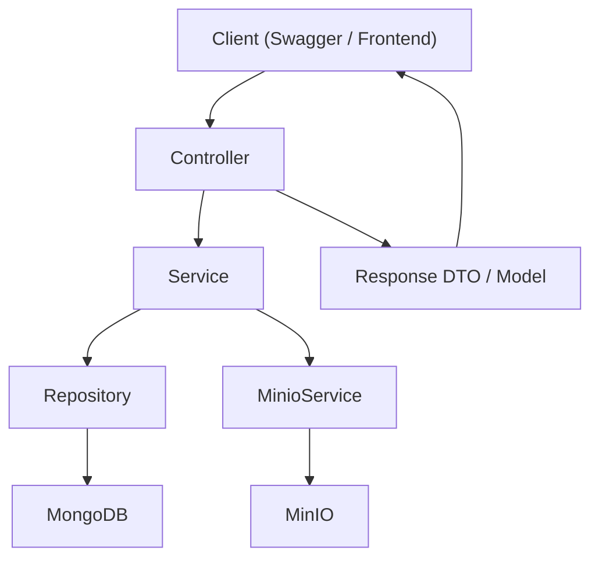

太好了，那我就直接開始帶你走一遍「請求流程」與「核心程式流向」，讓你能最快抓到全貌。

**全域流程圖**

**入口點（應用啟動）**
- `/Users/yu-hsin.chen/Documents/projects/fast-minio/src/main/java/com/example/chatgpt/ChatgptApplication.java`  
Spring Boot 啟動主入口。

**API 路由與流程**
1. **建立對話**
- 路由：`POST /api/sessions`
- Controller：`/Users/yu-hsin.chen/Documents/projects/fast-minio/src/main/java/com/example/chatgpt/controller/SessionController.java`
- Service：`/Users/yu-hsin.chen/Documents/projects/fast-minio/src/main/java/com/example/chatgpt/service/ChatSessionService.java`
- Repository：`/Users/yu-hsin.chen/Documents/projects/fast-minio/src/main/java/com/example/chatgpt/repository/ChatSessionRepository.java`
- Model：`/Users/yu-hsin.chen/Documents/projects/fast-minio/src/main/java/com/example/chatgpt/model/ChatSession.java`
- 流程：收到 userId/title → 建立 ChatSession → 存 MongoDB → 回傳 JSON

2. **查詢對話列表**
- 路由：`GET /api/sessions?userId=...`
- 流程：依 userId 查 ChatSession，回傳清單

3. **查詢對話歷史**
- 路由：`GET /api/sessions/{id}/messages`
- 流程：依 sessionId 查 ChatMessage，回傳訊息清單

4. **送訊息（核心）**
- 路由：`POST /api/chat/{sessionId}/send`
- Controller：`/Users/yu-hsin.chen/Documents/projects/fast-minio/src/main/java/com/example/chatgpt/controller/ChatController.java`
- Service：`/Users/yu-hsin.chen/Documents/projects/fast-minio/src/main/java/com/example/chatgpt/service/ChatService.java`
- 流程：
  - 檢查 session 是否存在  
  - 如果有 file → `MinioService.uploadFile()` 上傳  
  - 建立 user 訊息 → 存入 MongoDB  
  - 產生 mock AI 回覆 → 存入 MongoDB  
  - 回傳 `SendMessageResponse`

**外部整合（MinIO）**
- 設定：`/Users/yu-hsin.chen/Documents/projects/fast-minio/src/main/java/com/example/chatgpt/config/MinioConfig.java`  
- 屬性：`/Users/yu-hsin.chen/Documents/projects/fast-minio/src/main/java/com/example/chatgpt/config/MinioProperties.java`  
- 服務：`/Users/yu-hsin.chen/Documents/projects/fast-minio/src/main/java/com/example/chatgpt/service/MinioService.java`  
- 流程：啟動時確認 bucket → 上傳 → 回傳物件名稱

**資料模型（MongoDB）**
- `ChatSession`：`/Users/yu-hsin.chen/Documents/projects/fast-minio/src/main/java/com/example/chatgpt/model/ChatSession.java`
- `ChatMessage`：`/Users/yu-hsin.chen/Documents/projects/fast-minio/src/main/java/com/example/chatgpt/model/ChatMessage.java`
- `MessageRole`：`/Users/yu-hsin.chen/Documents/projects/fast-minio/src/main/java/com/example/chatgpt/model/MessageRole.java`

---
