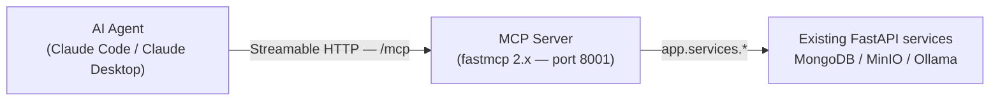

# MCP Server — chatgpt-fastapi

A [Model Context Protocol](https://modelcontextprotocol.io) server that wraps the
chatgpt FastAPI backend.  Exposes chat sessions, messages, and background tasks
as MCP **Tools** and **Resources** so AI agents (Claude Code, Claude Desktop,
etc.) can interact with the service directly.

## Architecture



- Runs as a **standalone process** (separate from the FastAPI app on port 8000).
- Listens on port **8001** by default.
- Uses the **Streamable HTTP** transport, not stdio.
- Shares the same `app.services.*` layer — no business logic duplication.

## Quick start

```bash
# 1. Ensure Docker services are running
docker compose -f ../../docker-compose.yml up -d

# 2. From the fastapi_backend directory
cd fastapi_backend
python3 -m venv .venv
source .venv/bin/activate
pip install -r requirements.txt

# 3. Start the MCP server
python -m mcp_server.server
```

The server starts at `http://localhost:8001/mcp`.  Verify:

```bash
curl http://localhost:8001/mcp -X POST \
  -H "content-type: application/json" \
  -d '{"jsonrpc":"2.0","method":"tools/list","id":1}'
```

## Environment variables

All variables are **optional**.  Defaults work for local development.

| Variable | Default | Description |
|---|---|---|
| `MCP_HOST` | `0.0.0.0` | Bind address |
| `MCP_PORT` | `8001` | Listen port |
| `MCP_RELOAD` | `0` | Set to `1` to enable auto-reload during development |
| `MCP_ALLOWED_ORIGINS` | `http://localhost:*,http://127.0.0.1:*` | Comma-separated Origin allow list (DNS rebinding protection). Supports `*`, `*.example.com`, `http://host:*` |

The following shared variables are read from environment or `.env` (see
`app/config.py` for defaults):

- `MONGO_URI`, `MONGO_DATABASE`
- `MINIO_ENDPOINT`, `MINIO_ACCESS_KEY`, `MINIO_SECRET_KEY`, `MINIO_BUCKET`
- `OLLAMA_BASE_URL`, `OLLAMA_MODEL`

## MCP Tools

| Name | Description | Side effect |
|---|---|---|
| `create_session` | Create a new chat session | ✅ writes to MongoDB |
| `send_message` | Send a message (non-streaming) and wait for the full LLM reply | ✅ writes to MongoDB + calls Ollama |
| `send_message_streaming` | Same as `send_message` but uses Ollama's streaming API internally | ✅ same |
| `create_background_task` | Submit an async task (summary, translate, etc.) | ✅ writes to MongoDB |
| `get_task_status` | Get current status of a background task; optionally poll until completion | ❌ read-only |
| `get_notebook_progress` | Get aggregate progress of all tasks in a notebook; optionally poll | ❌ read-only |

## MCP Resources

| URI Template | Description |
|---|---|
| `users://list` | List all distinct user IDs that have chat sessions |
| `users://{user_id}/sessions` | List chat sessions for a user |
| `sessions://{session_id}/messages` | List chat messages in a session |

## Attachments

`send_message` and `send_message_streaming` accept optional base64-encoded
attachments via `attachment_base64` + `attachment_filename`.  Maximum file
size: **10 MiB**.

## Claude Desktop / Claude Code integration

### Claude Desktop

Add to your `claude_desktop_config.json` (File → Settings → Developer → Edit
Config):

```json
{
  "mcpServers": {
    "chatgpt-backend": {
      "type": "url",
      "url": "http://localhost:8001/mcp"
    }
  }
}
```

### Claude Code

```bash
claude mcp add chatgpt-backend -t url http://localhost:8001/mcp
```

### Production deployment (internal network)

Replace the URL with the server's internal hostname:

```json
{
  "mcpServers": {
    "chatgpt-backend": {
      "type": "url",
      "url": "http://mcp.internal.example.com:8001/mcp"
    }
  }
}
```

## Testing with MCP Inspector

```bash
# Install the inspector (one-time)
npx @modelcontextprotocol/inspector

# Start the MCP server in one terminal
cd fastapi_backend
source .venv/bin/activate
python -m mcp_server.server

# In another terminal, run the inspector and point it at the server
npx @modelcontextprotocol/inspector http://localhost:8001/mcp
```

Then open the Inspector URL printed in the terminal (usually
`http://localhost:5173`).  You can call any tool or read any resource from the
UI.

## Running automated tests

```bash
cd fastapi_backend
source .venv/bin/activate

# Integration tests (requires MongoDB + MinIO + Ollama running)
python -m pytest tests/test_mcp_tools.py -v
```

## Limitations

- **No authentication** — intended for internal trusted networks only.  An
  `authenticate()` extension point is provided in `server.py` (see the
  `AuthContext` dataclass) for future OAuth2 / API key / mTLS integration.
- **Base64 attachments** only (max 10 MiB).  Streaming file uploads are not
  supported through the MCP protocol.
- **Task SSE events** are consumed internally by the tools (`get_task_status`,
  `get_notebook_progress`).  The raw SSE stream is not exposed to the MCP
  client.
- **Standalone process** — port 8001 must be open in addition to the FastAPI
  backend on port 8000.
- **Origin validation** is enforced server-side; update `MCP_ALLOWED_ORIGINS`
  if clients connect from unexpected origins.
